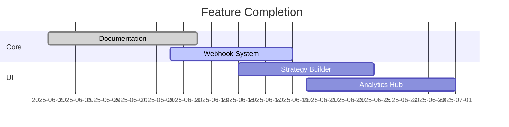

# TradeSync-AI Development Progress

## Implemented Features
- Base Expo React Native structure
- Tab navigation framework
- Strategy card components
- TradingView webhook endpoint

## Pending Tasks
1. AI chat integration
2. Broker API connectors
3. Real-time analytics dashboard
4. Automated trade execution flow

## Current Status

## Known Issues
- Webhook rate limiting not implemented
- Missing TypeScript types for TradingView payload
- Android build configuration pending

## Decision Log
- 2025-06-01: Chose Expo over React Native CLI for faster iteration
- 2025-06-05: Adopted Zustand instead of Redux for state management
- 2025-06-10: Prioritized crypto derivatives first in roadmap
