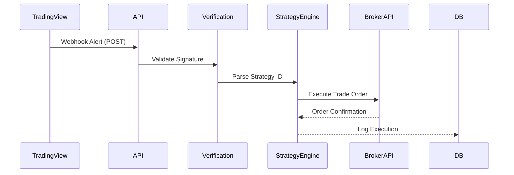

# TradeSync-AI System Patterns

## Architecture
- Mobile: Expo React Native (TypeScript)
- Backend: Next.js API Routes
- State: React Context + Zustand
- AI: OpenAI API integrations

## Key Technical Decisions
1. TradingView Webhook Architecture:
   - Secure webhook verification
   - Signature validation middleware
   - Rate-limited execution queue

2. Strategy Execution Flow:

3. Component Hierarchy:
- Root Layout
  - Tab Navigator
    - Trading Dashboard
    - Strategy Workshop
    - Analytics Hub
    - Settings

## Critical Paths
- Webhook processing latency < 500ms
- Trade execution confirmation within 2s
- Real-time price updates via WebSocket
